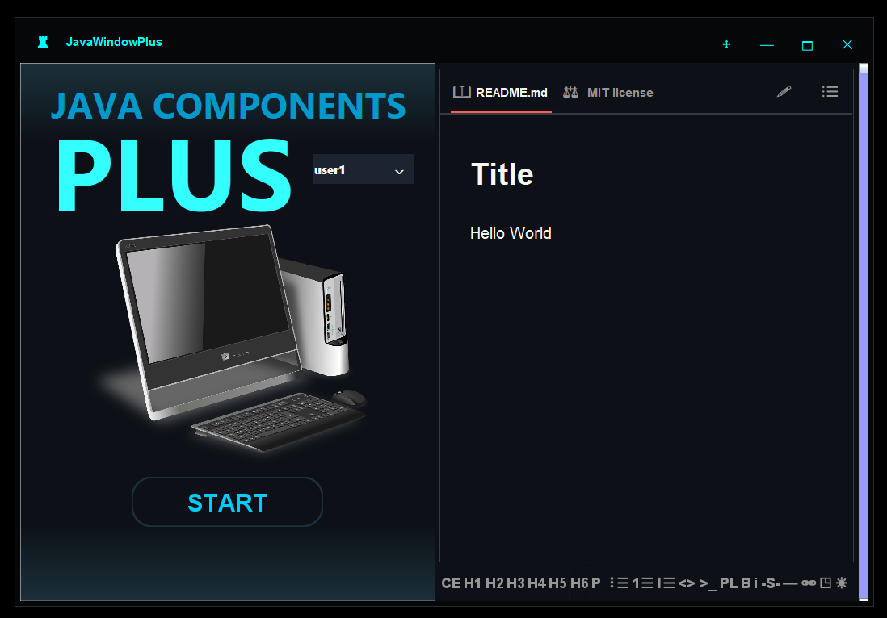

# Java Components Plus

###### version 2.0
## Descripción
**Java Components Plus** es una colección avanzada de componentes gráficos diseñados para mejorar la apariencia visual y la funcionalidad de **Java Swing**. A través de mejoras, retoques y la creación de nuevos componentes, esta librería ofrece una experiencia de usuario más moderna, elegante y personalizable.

Su objetivo es proporcionar herramientas mejoradas para desarrolladores que deseen crear interfaces gráficas más atractivas sin sacrificar la facilidad de implementación ni la compatibilidad con proyectos existentes.

## Características Principales

### 1. **Ventana Totalmente Personalizable**
- Diseño adaptable con múltiples opciones de personalización.
- Estilo moderno con efectos visuales mejorados.
- Codigo creado especificamente para ser facilmente editado con un par de clicks para comodidad del programador.

### 2. **Mejoras en Componentes Swing**
- **Panel con Gradiente**: capacidad de 8 gradientes con 4 direcciones posibles, con soporte para esquinas curvas.
- **Botones con Bordes Personalizados**: Estilización avanzada para una mejor integración en la interfaz.
- **ComboBox Estilizado**: Apariencia moderna.
- **Clase de AutoCompletado**: integralo en tus componentes de texto. 

### 3. **Editor Markdown Avanzado**
- **Edición en tiempo real** con compatibilidad completa para Markdown.
- **conversión a HTML y Markdown**, facilitando la integración con otros sistemas.
- **Interfaz intuitiva** con herramientas de formato enriquecido.
- **Vista previa dinámica** para una edición más eficiente.

## Beneficios
- **Mejora visual significativa** de las interfaces gráficas en Java Swing.
- **Facilidad de uso** con integración sencilla en proyectos Swing.
- **Mayor productividad** con componentes optimizados y modernos.
- **Personalización flexible**, adaptándose a diversas necesidades de desarrollo.
- **Compatibilidad con proyectos existentes**, sin requerir grandes modificaciones.

## Instalación y Uso
Para integrar **Java Components Plus** en tu proyecto, sigue estos pasos:

1. Descarga los componentes que necesites.
3. Importa los componentes en tu proyecto:
   ```java
    import ComponentCustoms.JavaWindowPlus;
   ```
4. Comienza a utilizar los nuevos elementos gráficos en tu aplicación:
   ```java
        JavaPanelPlus contentPanel = new JavaPanelPlus();
        contentPanel.setCOLORGRADIENT1(Color.RED);
        contentPanel.setCOLORGRADIENT2(Color.BLUE);
        contentPanel.setVisibleGradient(true);
        contentPanel.setNumGradients(2);
        contentPanel.setPreferredSize(new Dimension(500, 500));
        contentPanel.setLayout(new BorderLayout());

        JavaButtonPlus button = new JavaButtonPlus();
        button.setRadius(10);
        button.setBackgroundPlus(Color.YELLOW);

        JTextField textfieldDf = new JTextField();
        JavaTextCompleter completer = new JavaTextCompleter(textfieldDf, false, "Manzana, Mango, Mandarina");

        JavaComboPlus combo = new JavaComboPlus();
        combo.setBackgroundPlus(Color.black);
        combo.setForegroundPlus(Color.red);

        JMarkdonwEditor editorMark = new JMarkdonwEditor();

        JavaScrollPanePlus scrolls = new JavaScrollPanePlus();
        scrolls.setScrollThumbColor(Color.yellow);
        scrolls.setScrollThumbColor(Color.red);
        scrolls.setVerticalScrollBarPolicy(javax.swing.ScrollPaneConstants.VERTICAL_SCROLLBAR_ALWAYS);
        
        contentPanel.add(textfieldDf, BorderLayout.NORTH);
        contentPanel.add(editorMark, BorderLayout.CENTER);
        contentPanel.add(combo, BorderLayout.SOUTH);
        contentPanel.add(button, BorderLayout.EAST);
        contentPanel.add(scrolls, BorderLayout.WEST);

        JavaWindowPlus window = new JavaWindowPlus(contentPanel);
        window.setWindowBorderColor(Color.BLACK);
        window.setForeIconColor(Color.CYAN);
        window.setIconSimbol("★");
        window.setTitlePlus("TestWindow");
        window.setVisiblePlusRelativeTo(null);
   ```

## Autor
Desarrollado por Bryan amw.
