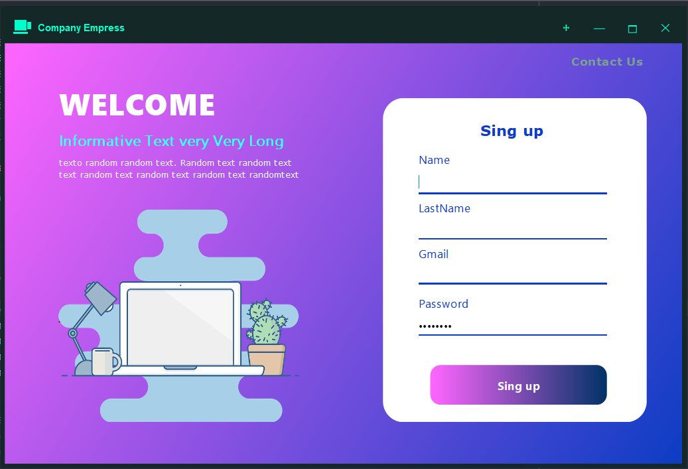
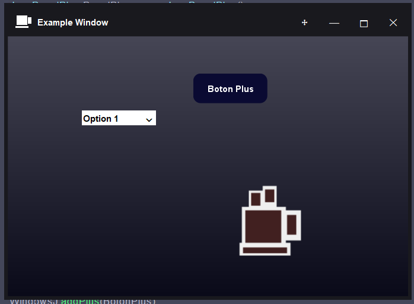

# Java Components Plus

**Java Components Plus** es un conjunto de componentes personalizados diseñados para mejorar la interfaz gráfica de usuario en aplicaciones Java. Estos componentes proporcionan una experiencia visualmente atractiva, son fáciles de integrar y personalizar, y están creados para su uso en entornos Java, especialmente con **Swing**.

## Diseño de Ejemplo



### Características del Componente

Este componente está diseñado para ofrecer una interfaz moderna y funcional. A continuación se detallan las principales características del componente `JavaWindowPlus` que se muestra en la imagen:

- **JFrame Personalizado**:
  - Permite redimensionamiento con control total (activación/desactivación).
  - Botones de control para la ventana:
    1. **Redimensionar**: Activa o desactiva el redimensionamiento de la ventana.
    2. **Minimizar**: Minimiza la ventana.
    3. **Maximizar**: Maximiza la ventana o regresa al estado original.
    4. **Cerrar**: Cierra la ventana del programa.
  
Este componente funciona junto con un **JavaPanelPlus**, ofreciendo una experiencia altamente personalizable. El código es fácilmente modificable, y se recomienda crear un panel y editarlo antes de agregarlo a la ventana mediante código.

- **JavaButtonPlus**:
  - Diseño plano con la opción de bordes redondeados.
- **JavaPanelPlus**:
  - Soporta degradados y una versión de color plano, con esquinas curvas opcionales.
- **JavaComboBox**:
  - Diseño inspirado en Visual Studio Community, con personalización completa de colores.
- **JavaLabelPlus**:
  - Permite mostrar imágenes de forma sencilla.

## Componentes Generales



La imagen anterior muestra una **visión general en estado base** de los distintos componentes. Este es el aspecto inicial de los componentes cuando son añadidos a tu proyecto, con un diseño limpio y sencillo. 

## Instalación
Para usar los componentes en tu proyecto Java, simplemente clona este repositorio o exporta los archivos a tu proyecto. Recuerda nombrar correctamente los paquetes en función de la estructura de carpetas de tu proyecto para evitar conflictos.

```bash
git clone https://github.com/Bamwilt/Java_ComponentsPlus.git
```

### Ejemplo de Código

A continuación se presenta un ejemplo básico de cómo usar los componentes en una aplicación:
Para usar los componentes en tu proyecto Java, simplemente clona este repositorio o exporta los archivos a tu proyecto. Recuerda nombrar correctamente los paquetes en función de la estructura de carpetas de tu proyecto para evitar conflictos.

```java
// Ejemplo de Código
JavaPanelPlus panelPlus = new JavaPanelPlus();
panelPlus.setVisibleGradient(true);
panelPlus.setLayout(null);

JavaButtonPlus botonPlus = new JavaButtonPlus("Botón Plus");
botonPlus.setBackgroundPlus(new Color(10, 10, 50));
botonPlus.setForeground(Color.WHITE);
botonPlus.setLocation(250, 50);
botonPlus.setSize(100, 40);
botonPlus.setRadius(20);

JavaImagenPlus imagenPlus = new JavaImagenPlus();
imagenPlus.setImagenPlus("javaComponentsPlus", "JavaIcon.png");
imagenPlus.setLocation(300, 200);

JavaWindowPlus ventana = new JavaWindowPlus(panelPlus, "Ventana de Ejemplo");

JavaComboPlus comboPlus = new JavaComboPlus();
comboPlus.setLocation(100, 100);

ventana.setVisible(true);
ventana.addPlus(comboPlus);
ventana.addPlus(botonPlus);
ventana.addPlus(imagenPlus);
```
